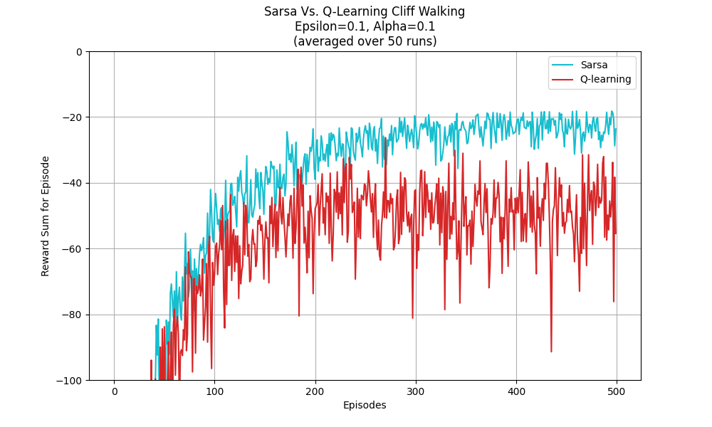
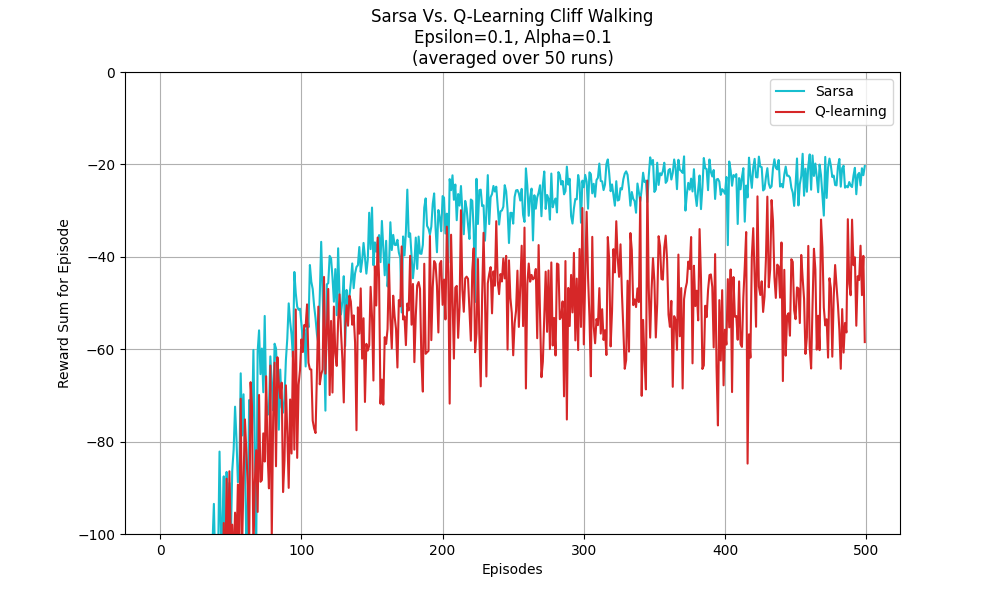
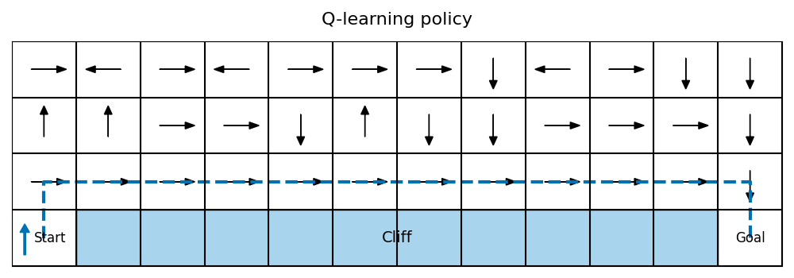
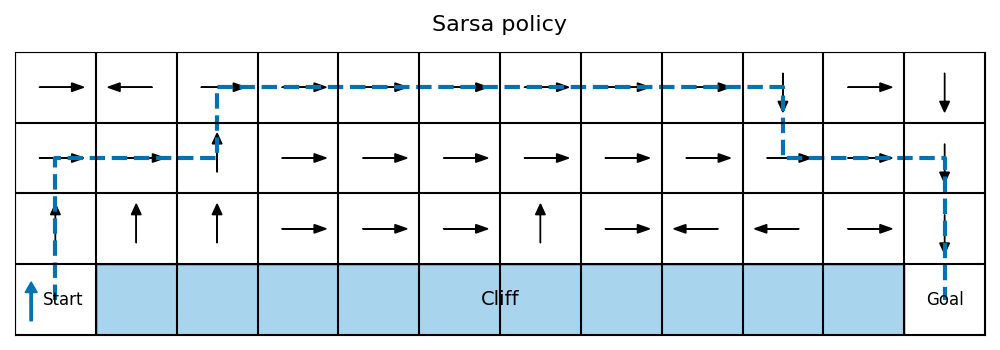

# 懸崖行走環境：Q-learning 與 SARSA 演算法比較分析

本專案旨在透過經典的「懸崖行走（Cliff Walking）」環境，實作並比較兩種經典強化學習演算法：**Q-learning**（離策略）與 **SARSA**（同策略）。藉由觀察其學習行為、收斂曲線以及最終策略，探討兩者在面臨高風險環境時的本質差異。

## 1. 環境設定與問題描述

本實驗採用 4 × 12 的網格世界，代理（Agent）需從左下角起點移動至右下角終點。起點與終點之間的底部區域為「懸崖」。

* **狀態空間（State Space）**：4 × 12 的所有網格位置。
* **動作空間（Action Space）**：上、下、左、右。
* **獎勵機制（Reward）**：
  * 每移動一步：-1
  * 掉入懸崖：-100（並強制重置回起點）
  * 到達終點：回合結束
* **學習參數**：$\epsilon$-greedy 策略 ($\epsilon=0.1$)、學習率 $\alpha=0.1$、折扣因子 $\gamma=0.9$。所有曲線為 50 次獨立訓練運行的平均值，訓練回合數為 500 回合。

## 2. 演算法理論與更新機制

兩種演算法行為差異的核心在於如何估算「目標價值（Target Value）」。

* **Q-learning (Off-policy)**: 
  其更新公式為：
  $$Q(s, a) \leftarrow Q(s, a) + \alpha [R + \gamma \max_{a'} Q(s', a') - Q(s, a)]$$
  更新時直接假設下一步會採取「價值最高」的動作，**忽略了實際執行時會受到 $\epsilon$-greedy 探索的干擾**。它傾向學習理論上的全局最佳解。

* **SARSA (On-policy)**:
  其更新公式為：
  $$Q(s, a) \leftarrow Q(s, a) + \alpha [R + \gamma Q(s', a') - Q(s, a)]$$
  更新基於「實際採取的下一個動作 $a'$」。這會將 $\epsilon$-greedy 帶來的隨機風險反映在價值估計中，使其策略更偏向安全。

## 3. 實驗結果分析

### 5.1 學習表現
下圖展示了每一回合的累積獎勵（Total Reward）曲線：

* **收斂速度**：SARSA 在此設定下（$\alpha=0.1$）呈現穩定爬升，約在 200-300 回合後穩定。
* **收斂水平**：SARSA 的累積獎勵明顯高於 Q-learning。由於 SARSA 會主動避開懸崖風險，其最終獎勵穩定在較高區間。

### 5.2 策略行為
最終學習到的路徑視覺化如下：

| Q-learning 策略 (冒險型) | SARSA 策略 (保守型) |
| :---: | :---: |
|  |  |

* **Q-learning**：傾向學習理論上的最佳策略（最短路徑），路徑緊貼懸崖邊緣。
* **SARSA**：傾向學習安全、穩定的行為，路徑遠離懸崖。

### 5.3 穩定性分析
* **波動程度**：Q-learning 在學習過程中波動劇烈，因其選擇路徑極易受探索（Exploration）影響而掉入懸崖。
* **探索影響**：在 $\epsilon=0.1$ 的設定下，10% 的隨機動作會導致緊貼懸崖的 Q-learning 頻繁受罰；SARSA 則因考慮了實際行動的風險，策略更具魯棒性。

## 4. 結論

1. **收斂較快且穩定**：若看訓練過程中的在線表現（Online Performance），**SARSA** 由於盡早避開了高風險區域，其收斂到穩定高獎勵的速度較快且波動較小。
2. **尋找理論最優**：若目標是找出純粹的理論最短路徑，則 **Q-learning** 能夠找到貼邊而行的全局最佳解。
3. **應用情境建議**：
   * 在**模擬環境**中訓練且只關注最終最佳策略時，建議選擇 **Q-learning**。
   * 若訓練發生在**真實世界**（例如自駕車或實體機器人），探索期間的高昂失誤成本（如撞車）難以承受時，務必選擇較為安全、保守的 **SARSA**。
